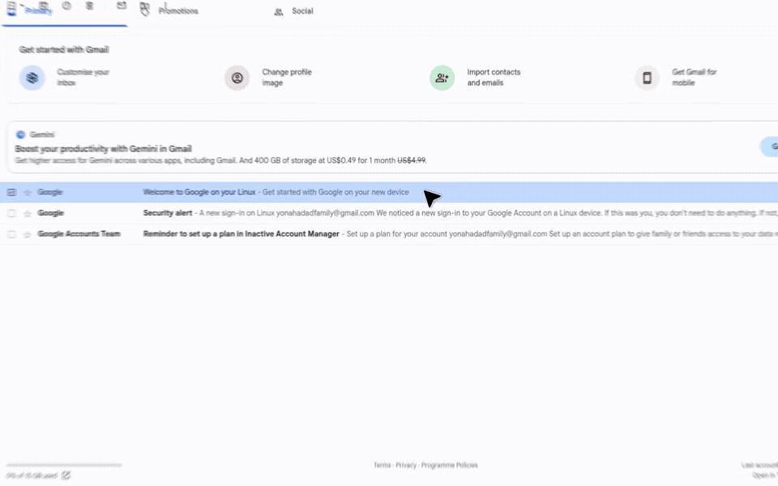

# Find emails from sender

Gmail used to have a button for this. This tiny Chrome and Firefox extension puts it back: open a thread, click the person icon, and jump to every message from that sender.



## Install

Grab the Chrome or Firefox zip from [Releases](../../releases).

- **Chrome:** unpack, then Load unpacked on `chrome://extensions` (Developer mode on).
- **Firefox:** `about:debugging#/runtime/this-firefox` → Load Temporary Add-on → select `manifest.json`.

Allow the extension to run on `mail.google.com`.

## Releases

Publish a GitHub release tagged `vX.Y.Z`. CI writes that version into `package.json` and attaches both zips to the release.

## Dev

```sh
pnpm install
pnpm dev          # Chrome
pnpm dev:firefox  # Firefox
```

User icons by [Freepik on Flaticon](https://www.flaticon.com/free-icons/user).
